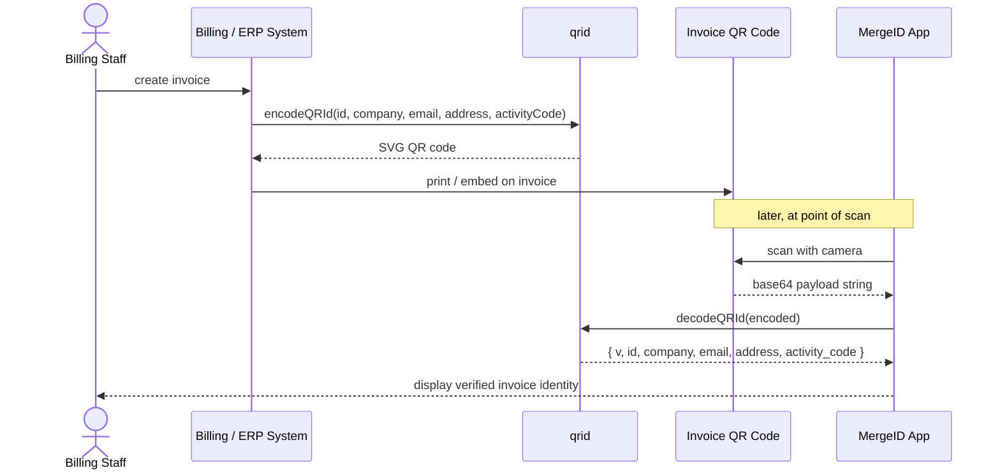

# qrid — Node.js

Decode and encode **MergeID electronic invoice QR codes**.

TypeScript port of [`qrid/codec`](https://packagist.org/packages/qrid/codec) (PHP). Both libraries share the same payload format, function names, and parameter signatures, so QR codes generated by either implementation scan correctly in the other.

## Typical usage flow



## Installation

```bash
# Decode only (no extra dependencies)
npm install @qxdev/qrid
# or: yarn add @qxdev/qrid

# Decode + encode SVG
npm install @qxdev/qrid qrcode
# or: yarn add @qxdev/qrid qrcode
```

## Usage

### Decode

```typescript
import { decodeQRId } from '@qxdev/qrid';

// `encoded` is the raw string value scanned from a MergeID QR code
const payload = decodeQRId(encoded);

console.log(payload.v);             // Payload schema version (number, currently 1)
console.log(payload.id);            // Tax or company ID              (e.g. "3101679980")
console.log(payload.company);       // Company legal name
console.log(payload.email);         // Billing e-mail address
console.log(payload.address);       // Physical address
console.log(payload.activity_code); // Installation / activity code (e.g. "ACT-001"), or "" if blank
```

`decodeQRId` trims surrounding whitespace from the input before decoding, so strings
copied with accidental padding are handled transparently.

**Exceptions thrown:**

| Exception | Cause |
| --- | --- |
| `TypeError` | Input is not valid base64 |
| `SyntaxError` | Decoded bytes are not valid JSON |

```typescript
import { decodeQRId } from '@qxdev/qrid';

try {
  const payload = decodeQRId(raw);
} catch (err) {
  if (err instanceof TypeError) {
    // QR data was not base64
  } else if (err instanceof SyntaxError) {
    // QR data decoded but was not the expected JSON structure
  }
}
```

### Encode (requires `qrcode`)

```typescript
import { encodeQRId } from '@qxdev/qrid';

const svg = await encodeQRId(
  '3101679980',
  'Acme Corp S.A.',
  'billing@acme.example',
  '123 Main St, San José, Costa Rica',
  'ACT-001',
);

// Serve as an image
res.setHeader('Content-Type', 'image/svg+xml');
res.send(svg);
```

`activityCode` is optional and defaults to `''` (blank). A blank activity code signals a
consuming system to generate an electronic ticket instead of using an activity code.

> **Note:** `encodeQRId` is async because the underlying `qrcode` library uses async
> rendering. The PHP equivalent (`Codec::encodeQRId`) is synchronous — this is the
> only API difference between the two implementations.

**Exceptions thrown:**

| Exception | Cause |
| --- | --- |
| `Error` | `qrcode` peer dependency is not installed |

## Payload format

The QR code data is a UTF-8 JSON object encoded as standard base64 (no line-breaks):

```json
{
  "v": 1,
  "id": "3101679980",
  "company": "Acme Corp S.A.",
  "email": "billing@acme.example",
  "address": "123 Main St, San José, Costa Rica",
  "activity_code": "ACT-001"
}
```

| Field | Type | Description |
| --- | --- | --- |
| `v` | `number` | Payload schema version. Currently always `1`. |
| `id` | `string` | Tax / company registration ID. |
| `company` | `string` | Legal company name (UTF-8, including accented characters). |
| `email` | `string` | Primary billing or contact e-mail address. |
| `address` | `string` | Physical address of the company. |
| `activity_code` | `string` | Installation or activity code that links the QR to an internal record. May be blank (`""`), which signals a consuming system to generate an electronic ticket instead. |

## Requirements

| Dependency | Version | Required for |
| --- | --- | --- |
| Node.js | `>= 18` | Always |
| `qrcode` | `^1.5` | `encodeQRId()` only |

## Running tests

```bash
npm install
npm test
```

## Build from source

```bash
npm run build   # emits dist/ (JS + .d.ts)
```

## Publishing

Releases to npm are fully automated — there is no manual `npm publish` step:

1. Bump `version` in `package.json` and merge to `main`.
2. [`release.yml`](.github/workflows/release.yml) runs on every push to `main`. It reads the version from `package.json`; if no `vX.Y.Z` tag already exists for it, it runs the test suite and creates that tag plus a GitHub Release.
3. In that same run, `release.yml` dispatches [`publish.yml`](.github/workflows/publish.yml) via the GitHub API (`gh workflow run publish.yml`), which re-runs the tests across supported Node versions and publishes to npm using [Trusted Publishing (OIDC)](https://docs.npmjs.com/trusted-publishers) with provenance — no stored `NPM_TOKEN`.

`publish.yml` is dispatched as an independent, top-level run via the Actions API rather than invoked as a reusable workflow (`workflow_call`) or relying on the `release: published` event. Both alternatives were tried and both are broken for this use case:

- `release: published` never fires for releases created with the Actions-internal `GITHUB_TOKEN` (GitHub's anti-recursion guard).
- `workflow_call` chaining runs `publish.yml` as a job *within* `release.yml`'s own run, so the OIDC certificate's build-config claim identifies the caller (`release.yml`) instead of `publish.yml` — the registry's Trusted Publisher verification then rejects the upload (confirmed via PyPI's equivalent error for the sibling `qrid-python` package; PyPI's docs explicitly state reusable workflows are unsupported for Trusted Publishing, and npm's OIDC verification is understood to have the same limitation).

A `workflow_dispatch` API call made with `GITHUB_TOKEN` is explicitly exempt from the anti-recursion guard and starts a genuine new top-level run of `publish.yml`, so its OIDC certificate correctly identifies `publish.yml` as the source. `publish.yml` also still accepts `release: published` (for a release cut by hand) and `workflow_dispatch` (manual re-run) as a fallback.

Pushes to `main` that don't change the version are a no-op for `release.yml` (the tag already exists), so unrelated commits (docs, CI tweaks) don't trigger a release.

**One-time npm setup** (documented here for reference): on the package's [Settings page](https://www.npmjs.com/package/@qxdev/qrid/access) → **Trusted Publisher** → add a GitHub Actions publisher with owner `Quality-XP-Development-SESSA`, repository `qrid-node`, workflow filename `publish.yml`, and environment name `npm`; the same `npm` environment must exist under the repo's GitHub Settings → Environments. Requires npm CLI >= 11.5.1; the publish job uses Node 24 (bundles npm 11.16+) rather than upgrading npm in place, since a global `npm install -g npm@latest` on GitHub-hosted runners is known to leave a broken install (missing the optional `sigstore` dependency needed for `--provenance`).

## License

MIT
